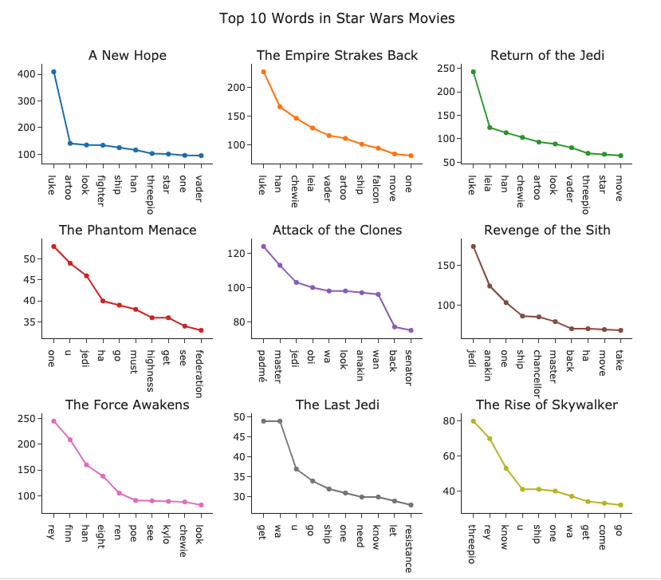
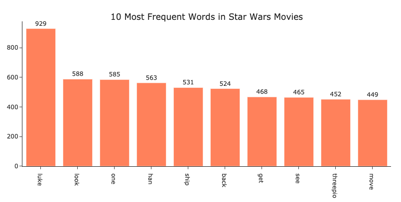

# Word Frequency in Star Wars :speech_balloon:

### Tools: beautifulsoup, requests, pandas, plotly, nltk 

In this project, I will try to find out which words occurred more frequently in Star Wars movies. To do this I extracted transcripts of those movies from transcripts.fandom.com with use of beautifulsoup and requests. After that, I performed data cleaning and analysis using nltk.  

filename | description
------------ | -------------
[WebScrapingTranscripts.py](WebScrapingTranscripts.py) | Used beautifulsoup and requests library to extract transcripts of Star Wars movies. 
[WordFrequencyStarWars.ipnyb](WordFrequencyStarWars.ipynb) | Contains analysis of the distribution of words in Star Wars movie transcripts with the use of Natural Language ToolKit(nltk).

## What are the most frequent words in Star Wars movies? 

Most frequent word in the first three movies : 'A New Hope','Empire Strikes Back' and ' Return of the Jedi' was Luke. 
For the 'Phantom Mentance' most common word was word one, for 'Attack of the Clones' it was Padme and for 'Revenge of the Sith' it was jedi.
The most popular word in 'The Force Awakens' was Rey, for 'The Last Jedi' it was word 'get' and for the last movie - 'The Rise of Skywalker' it was Threepio. 

## Which word was the most common? 
  
 

 The most common word in Star Wars movies is luke and it occurs 929 times.
 
