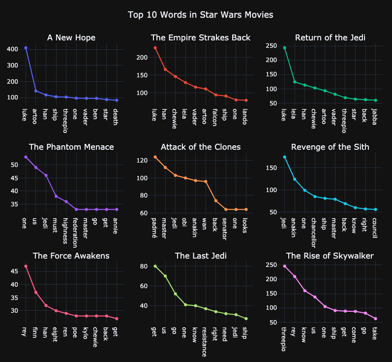

# Word Frequency in Star Wars :speech_balloon:

The purpose of this project is to find out what are the most frequent words in Star Wars movies and how often they occur.

filename | description
------------ | -------------
[WebScrapingTranscripts.py](WebScrapingTranscripts.py) | Used beautifulsoup and requests library to extract transcripts of Star Wars movies. 
[WordFrequencyStarWars.ipnyb](WordFrequencyStarWars.ipynb) | Contains analysis of the distribution of words in Star Wars movie transcripts with the use of Natural Language ToolKit(nltk).

